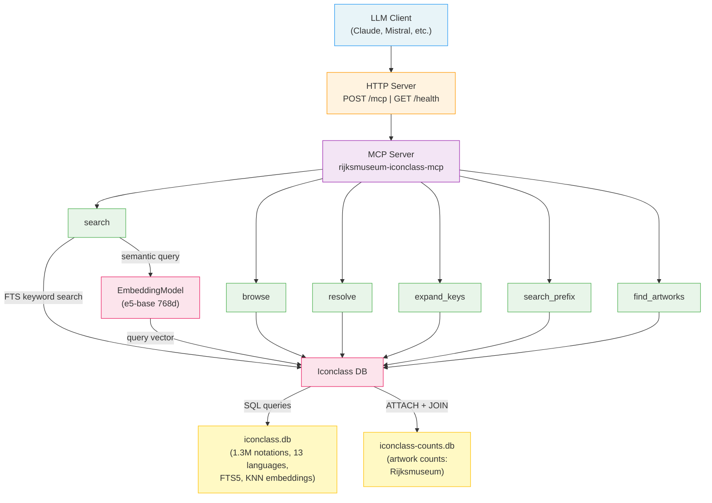

# rijksmuseum-iconclass-mcp

[](https://modelcontextprotocol.io/specification/2025-11-25)

**rijksmuseum-iconclass-mcp** is a tool for searching and exploring [Iconclass](https://iconclass.org) notations in natural language with an AI assistant. It was designed as a companion service for [rijksmuseum-mcp+](https://github.com/kintopp/rijksmuseum-mcp-plus), an analogous resource for the [Rijksmuseum's](https://www.rijksmuseum.nl/en) art collections.

The tool provides access to over 1.3 million Iconclass notations — all of the c. 39,000 base concepts and c. 1.3 million key-expanded variants that add modifiers like posture, context, or symbolism. Beside simple keyword matching, rijksmuseum-iconclass-mcp supports semantic search in natural language, so that you can discover iconclass notations related to concepts like "homesickness and exile" -> `94I2111 — "Ulysses longs for home"` even when your exact search term doesn't appear in the notation text. You can also, for example, use the AI assistant to explore the Iconclass hierarchy, visualise its structure, or to request cataloguing advice. The database includes data from the [Rijksmuseum](https://www.rijksmuseum.nl/en/collection) showing how many artworks are tagged with a particular Iconclass notation. 

The resource was developed as a technology demo by the [Research and Infrastructure Support](https://rise.unibas.ch/en/) (RISE) group at the University of Basel and complements our ongoing work on [benchmarking](https://github.com/RISE-UNIBAS/humanities_data_benchmark) and [optimising](https://github.com/kintopp/dspy-rise-humbench) humanities research tasks carried out by large language models (LLMs). We are particularly interested in exploring the research opportunities, methodological risks, and technical challenges posed by retrieving and analysing data with LLMs. If you are interested in collaborating with us in this area, please [get in touch](mailto:rise@unibas.ch).

## Quick start

For the best results, add rijksmuseum-iconclass-mcp as a custom connector in [Claude Desktop](https://claude.com/download) or [claude.ai](https://claude.ai) using the URL below. This currently requires a paid ('Pro') or higher [subscription](https://claude.com/pricing) from Anthropic.

```
https://rijksmuseum-iconclass-mcp-production.up.railway.app/mcp
```

Go to _Settings_ → _Connectors_ → _Add custom connector_ → name it as you like and paste the URL into the _Remote MCP Server URL_ field. You can ignore the Authentication section. Once configured, optionally set the permissions for its tools (e.g. 'Always allow'). See Anthropic's [instructions](https://support.claude.com/en/articles/11175166-get-started-with-custom-connectors-using-remote-mcp) for  details. To learn how to use rijksmuseum-iconclass-mcp with a different AI assistant **without a paid subscription**, please see [Choosing an AI System](#choosing-an-ai-system) below.

**Recommended:** Next, follow the same procedure to install its companion resource, [rijksmuseum-mcp+](https://github.com/kintopp/rijksmuseum-mcp-plus). This allows you to explore over 830,000 artworks and metadata records from the Rijksmuseum with semantic search, provenance analysis, similarity comparisons, and spatial reasoning. 

## Research skill

The [`rijksmuseum-iconclass-mcp.skill`](docs/rijksmuseum-iconclass-mcp.skill.zip) file (.zip archive) is a [research skill](https://support.claude.com/en/articles/12512176-what-are-skills) that gives the AI assistant detailed guidance on how best to use this resource effectively: which tool (see [How it works](#how-it-works)) to choose for a given question type, how to combine searches, important metadata distinctions (e.g. `subject` terms vs `iconclass` notations), and known limitations. Installing the skill is optional but will significantly improve the quality and efficiency of your AI assistant's responses. 

The skill can be installed in Claude by following [these instructions](https://claude.com/resources/tutorials/teach-claude-your-way-of-working-using-skills). Skill files were originally developed by Anthropic for their Claude products but have since become an [open standard](https://agentskills.io/home). Even chatbots and applications without explicit support for skill packages can make use of the rijksmuseum-iconclass-mcp skill by uploading/sharing the [SKILL.md](docs/SKILL.md) file directly with the AI assistant at the start of a research session. Some chatbots (e.g. Mistral's [LeChat](https://chat.mistral.ai/chat)) allow you to permanently share files across sessions by uploading it to a [personal library](https://help.mistral.ai/en/articles/347582-what-are-libraries-and-how-do-i-use-them-in-le-chat). 

## Sample Queries

After you've connected the resource to your AI system, you can search, explore and ask questions about the Iconclass in natural language. For examples of the kinds of queries the systems can answer, please see these [example prompts](docs/example-prompts.md). The links following each prompt show you how that query was previously answered in Claude Desktop. 

## Choosing an AI system

Technically speaking, both rijksmuseum-iconclass-mcp and rijksmuseum-mcp+ are based on the open [Model Context Protocol](https://modelcontextprotocol.io/docs/getting-started/intro) (MCP) standard. As such, they also work with generative large language models (LLMs) in other chatbots and applications which support this standard, including several which can be used **without a paid subscription** (see below). However, to date none beside [Claude Desktop](https://claude.com/download) and [claude.ai](https://claude.ai) support viewing, analysing, and interacting with images and visualisations directly in the chat timeline. If this capability is important to you, then your best (and only) choice is to use Anthropic Claude with a monthly subscription. 

However, if you don't need these interactive features, or only want to use rijksmuseum-iconclass-mcp, you can use it just as well with many other, free to use, browser based chatbots supporting the MCP standard. Mistral's [LeChat](https://chat.mistral.ai/chat) (follow these [instructions](https://help.mistral.ai/en/articles/393572-configuring-a-custom-connector)) is a fine example of a browser based chatbot with good, basic MCP support. In addition, many desktop 'LLM client' applications, such as [Jan.ai](https://jan.ai), are also compatible, and can even be used with different cloud or locally hosted LLM models. Agentic coding applications (e.g. Claude Code, OpenAI Codex, Google Gemini CLI) also support the MCP standard. In contrast, OpenAI's ChatGPT still only offers limited, 'developer mode' support for MCP servers, and while Google has announced MCP support for Gemini it has not indicated when this feature will be ready. Currently (April, 2026) the best, free alternative to Claude for most people is probably Mistral's LeChat.

## How it works

When you ask a question, your AI assistant sends it to the rijksmuseum-iconclass-mcp server using the Model Context Protocol (MCP) standard. The server holds a SQLite database of c. 1.3M Iconclass notations. Depending on the query, the server can search this database in two complementary ways: a fast full-text search that matches keywords, or a semantic search that uses vector embeddings (numerical representations of meaning) to find notations by concept rather than exact wording. A separate, small database records how many artworks in the Rijksmuseum collection are tagged with each notation, letting the server report back to a user not just what a code means but how many artworks exist for it. The server exposes six tools — search, browse, resolve, expand_keys, search_prefix, and find_artworks – which are described in more details below. 

### `search` — keyword or semantic search

Find notations by text or concept.

```
query: "crucifixion"          → 844 FTS matches across labels and keywords
semanticQuery: "domestic animals" → top matches by embedding similarity
```

| Parameter | Description |
|-----------|-------------|
| `query` | FTS keyword search (13 languages, multi-word fallback) |
| `semanticQuery` | Semantic concept search (finds by meaning, not exact words) |
| `parentNotation` | Restrict results to a subtree (e.g. `"11F"` for Virgin Mary) |
| `onlyWithArtworks` | Filter to notations with artworks in any loaded collection |
| `collectionId` | Filter to a specific collection (e.g. `"rijksmuseum"`) |
| `lang` | Preferred language for labels (default: `en`) |
| `maxResults` | 1–50 (default 25) |

Provide exactly one of `query` or `semanticQuery`.

### `browse` — navigate the hierarchy

Explore a notation's place in the tree: path, children (expandable to depth 1–3), cross-references, key variants.

```
notation: "73D", depth: 2  → Passion of Christ, children + grandchildren
notation: "25F23", includeKeys: true  → 204 key-expanded variants
```

### `resolve` — batch notation lookup

Look up one or more notations by code. Accepts a single string or an array of up to 25.

```
notation: ["73D6", "31A33", "25F23"]  → full metadata for each
```

### `expand_keys` — key variant exploration

Given a base notation, return all its key-expanded variants with texts and collection data.

```
notation: "25F23"  → 204 variants (swimming, sleeping, fighting, etc.)
```

### `search_prefix` — hierarchical subtree search

Find all notations under a hierarchy prefix. Leverages Iconclass's left-to-right encoding.

```
notation: "73D8"  → 8 notations under "instruments of the Passion"
notation: "25F"   → all animal notations
```

### `find_artworks` — how many artworks use this subject?

Given one or more notations, check which collections have artworks tagged with those notations. Returns per-collection artwork counts and link-out URLs where available. An empty `collections` array means no loaded collection has artworks for that notation — try a parent or sibling notation instead.

```
notation: "73B57"  → Rijksmuseum: 24 artworks
notation: ["73D6", "92D192134"]  → batch lookup with counts
```

This currently only provides data from the Rijksmuseum in Amsterdam. 

## Technical Notes

For local setup (stdio or HTTP), deployment, architecture, data sources, and configuration, please see the [technical guide](docs/technical-guide.md).



## Authors

[Arno Bosse](https://orcid.org/0000-0003-3681-1289) — [RISE](https://rise.unibas.ch/), University of Basel with [Claude Code](https://claude.com/product/claude-code), Anthropic.

## Citation

If you use rijksmuseum-iconclass-mcp in your research, please cite it as follows:

**APA (7th ed.)**

> Bosse, A. (2026). *rijksmuseum-iconclass-mcp* (Version 0.3.0) [Software]. Research and Infrastructure Support (RISE), University of Basel. https://github.com/kintopp/rijksmuseum-iconclass-mcp

**BibTeX**
```bibtex
@software{bosse_2026_rijksmuseum_iconclass_mcp,
  author    = {Bosse, Arno},
  title     = {{rijksmuseum-iconclass-mcp}},
  year      = {2026},
  version   = {0.3.0},
  publisher = {Research and Infrastructure Support (RISE), University of Basel},
  url       = {https://github.com/kintopp/rijksmuseum-iconclass-mcp},
  orcid     = {0000-0003-3681-1289},
  note      = {Developed with Claude Code (Anthropic, \url{https://www.anthropic.com})}
}
```

## License

MIT

## Acknowledgements

The [Iconclass](https://iconclass.org) classification system was created by Henri van de Waal and is maintained by the Iconclass Foundation. The [data](https://github.com/iconclass/data) used in this server is published under a Creative Commons CC0 license.
