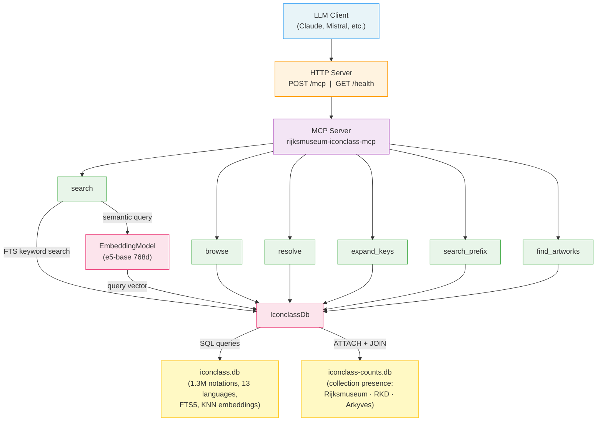

# Architecture

```mermaid
graph TB
    Client["LLM Client<br/>(Claude, Mistral, etc.)"] --> HTTP["HTTP Server<br/>POST /mcp &nbsp;|&nbsp; GET /health"]

    HTTP --> MCP["MCP Server<br/>rijksmuseum-iconclass-mcp"]

    MCP --> T1["search"]
    MCP --> T2["browse"]
    MCP --> T3["resolve"]
    MCP --> T4["expand_keys"]
    MCP --> T5["search_prefix"]
    MCP --> T6["find_artworks"]

    T1 -->|"FTS keyword search"| DB["IconclassDb"]
    T1 -->|"semantic query"| EMB["EmbeddingModel<br/>(e5-base 768d)"]
    EMB -->|"query vector"| DB

    T2 & T3 & T4 & T5 & T6 --> DB

    DB -->|"SQL queries"| MAIN["iconclass.db<br/>(1.3M notations, 13 languages,<br/>FTS5, KNN embeddings)"]
    DB -->|"ATTACH + JOIN"| COUNTS["iconclass-counts.db<br/>(collection presence:<br/>Rijksmuseum · RKD · Arkyves)"]

    style Client fill:#e8f4f8,stroke:#2196F3
    style HTTP fill:#fff3e0,stroke:#FF9800
    style MCP fill:#f3e5f5,stroke:#9C27B0
    style T1 fill:#e8f5e9,stroke:#4CAF50
    style T2 fill:#e8f5e9,stroke:#4CAF50
    style T3 fill:#e8f5e9,stroke:#4CAF50
    style T4 fill:#e8f5e9,stroke:#4CAF50
    style T5 fill:#e8f5e9,stroke:#4CAF50
    style T6 fill:#e8f5e9,stroke:#4CAF50
    style DB fill:#fce4ec,stroke:#E91E63
    style EMB fill:#fce4ec,stroke:#E91E63
    style MAIN fill:#fff9c4,stroke:#FFC107
    style COUNTS fill:#fff9c4,stroke:#FFC107
```
